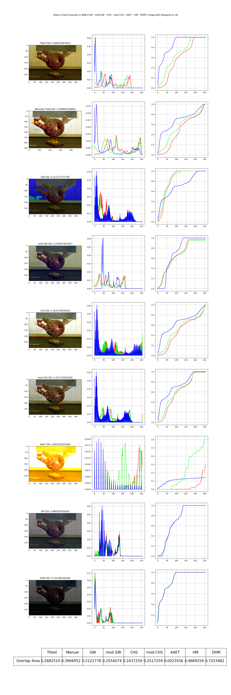

# AWB-Lib

Implementation of a bunch of Automatic White-Balancing (AWBE algorithms), using JAX. Comparisons and experiments can be found in `docs` folder.

## Implemented Algorithms

1. Gray World (GW), based on gray world assumption. See `awblib.gw`.
2. Colour Histogram Stretching (CHS). See `awblib.chs`.
3. Average Equalization and Threshold (AAET). See `awblib.aaet`.
4. Histogram Matching (AWB-HM), based on histogram matching. See `awblib.hm`.
5. Dynamic Histogram Matching (AWB-DHM), based on histogram matching and channel selection. See `awblib.dhm`.

### AWB-DHM

> T. Gollanapalli, V. R. Peddigari and P. S. Madineni, "Auto white balance using dynamic histogram matching for AMOLED panels," 2017 IEEE International Conference on Consumer Electronics-Asia (ICCE-Asia), Bengaluru, India, 2017, pp. 41-46, doi: 10.1109/ICCE-ASIA.2017.8307848.

Explanations about our implementation is [here](docs/dhm/README.md).

### AWB-HM

> Chengqiang Huang, Qi Zhang, Hui Wang, and Songlin Feng, "A Low Power and Low Complexity Automatic White Balance Algorithm for AMOLED Driving Using Histogram Matching," J. Display Technol. 11, 53-59 (2015)

Explanations about our implementation is [here](docs/hm/README.md). This implementation largely reproduced the results.

## Example Results

See [`docs`](docs/README.md) for more.

## Notes

Actually no paper has mentioned that if they are invariant to colour space or they depend on a  specific colour space. As far as I know, most non-ML image processing algorithms require linear RGB; this processing is not done in this module yet.

## License

Apache-2.0
