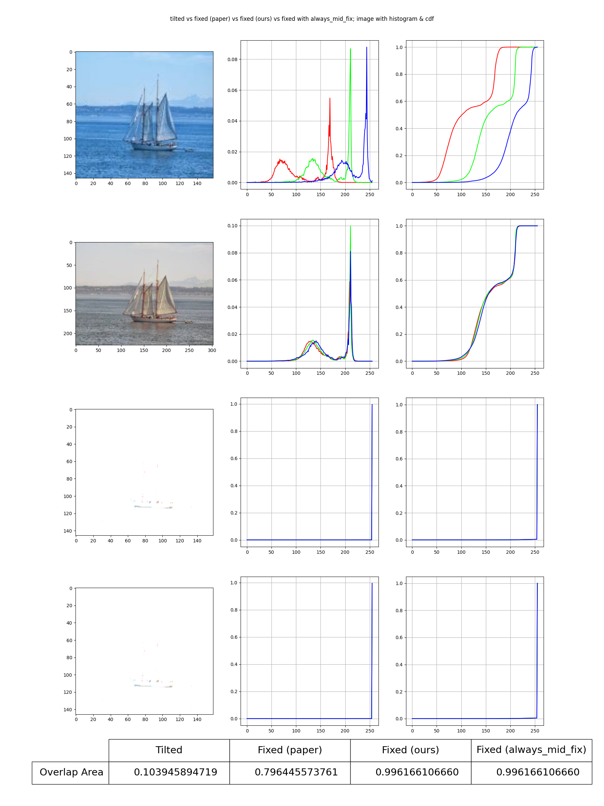
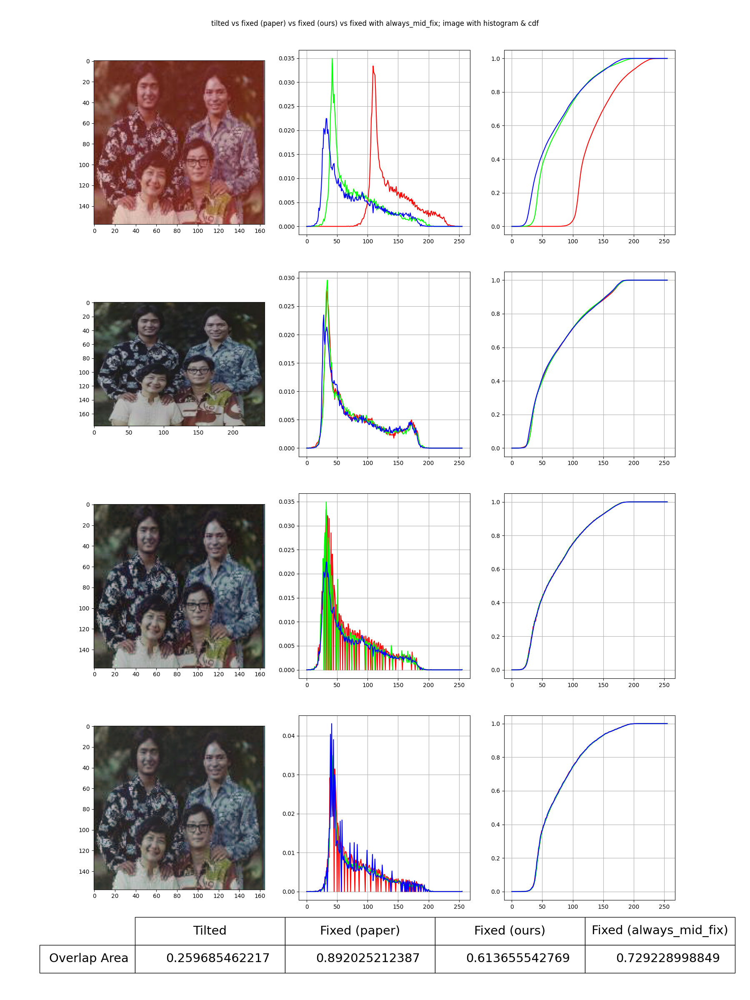
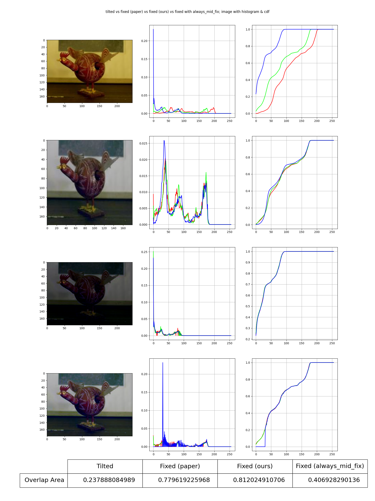
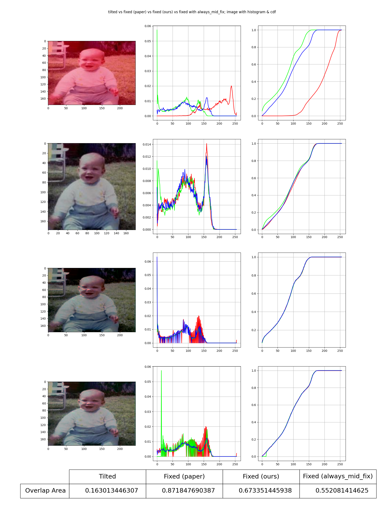
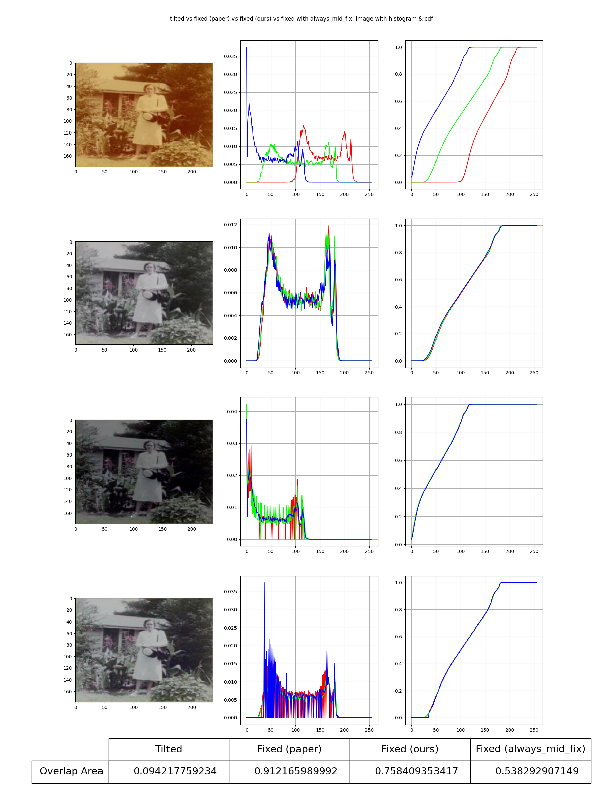
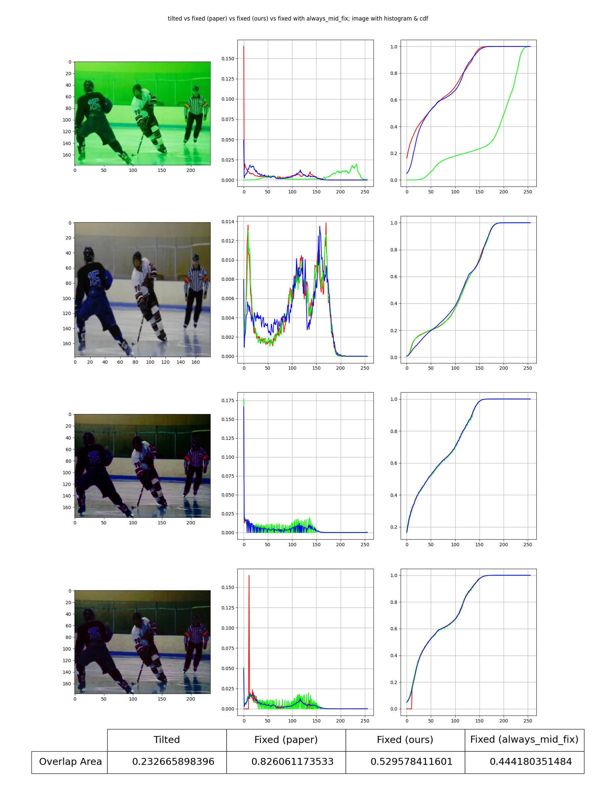
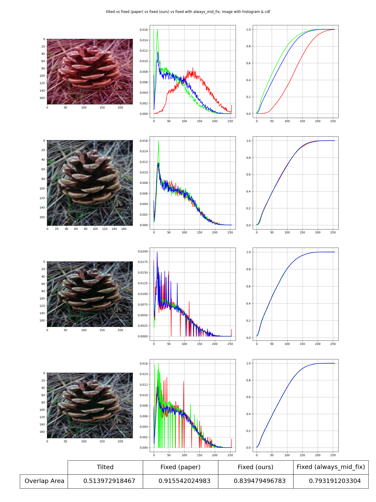
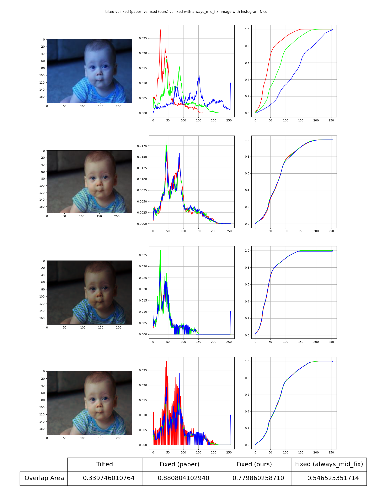
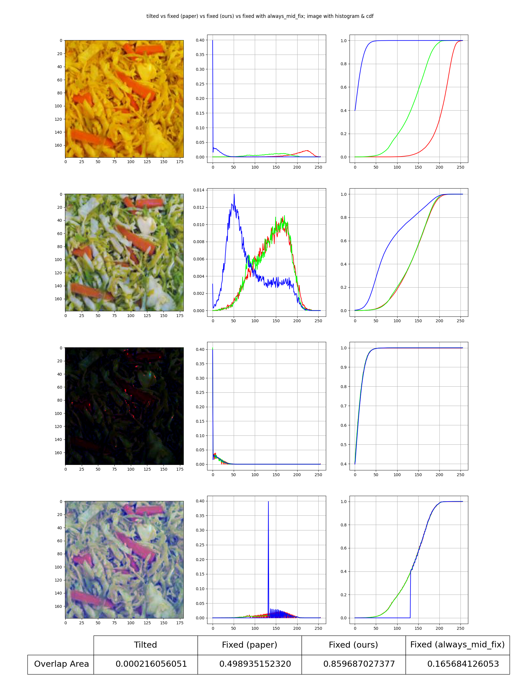

# AWB-DHM: Auto White Balance Using Dynamic Histogram Matching For AMOLED Panels

> Original paper: T. Gollanapalli, V. R. Peddigari and P. S. Madineni, "Auto white balance using dynamic histogram matching for AMOLED panels," 2017 IEEE International Conference on Consumer Electronics-Asia (ICCE-Asia), Bengaluru, India, 2017, pp. 41-46, doi: 10.1109/ICCE-ASIA.2017.8307848.
>
> This is a reimplementation of the paper, using JAX.

## Usage

1. Install the package `awblib`.
2. From `awblib.dhm` import `balance`.
3. Pass to the `balance` with an image, which must be either a JAX array or a numpy array (or compatible formats), with a shape of `(height, width, channels)`, where `channels == 3` (as only supports RGB images for now). There is no specific restrictions on height nor width; it just defines the output shape, as the return value will have same shape as the given input.

## Some Notes on the paper reimplementation

You may check the comments in the implementation file for the details.

1. For section 3.2 in the paper, CRITERIA I and II, the author did not specify what does *majority of the pixels* mean; we suppose this means more than half of the pixels in the image.
2. For Section 3.2 CRITERIA I Step 2, the author did not specify whether `Imax` is the maximum, the average or something else of the intensities of the selected channel. We use this is an *average*, as it is being used to divide another average (average intensity of the whole channels).
3. For Section 3.2 CRITERIA I Step 2, we assume $K$ is a scalar constant, being the same across all channels and the whole image.
4. For Section 3.2 CRITERIA II Step 1, the author claims that the dynamic range is 0-127, which might be wrong. Think about an image with only few pixels being 255 in the selected channel, and all other values are near 0.
5. For Section 3.2 CRITERIA II Step 2, experiments (use `gen_comparison.py` in this folder) shows that the selection criteria is wrong. Our best and closest results are obtained by always choosing the channel with sum (or mean) intensities being the middle of the three, if the average intensity of the image falls below half gray (127 for 8-bit image).
6. For Section 3.2 CRITERIA II, we assume that "channel with minimum intensity" means the channel with the sum (mean) intensities of that channel over all pixels in the image is the minimum among the three. I.e., $\textrm{argmin}_{c\in\{R, G, B\}} \sum_{x, y} I_{c, (x,y)}$, where $I_{c, (x,y)}$ is the intensity of the pixel at $(x, y)$ of channel $c$.

## Evaluation on Performance

Our reimplementation is not as good as the paper claims, which may due to several reasons:

1. The misunderstanding of the paper's idea.
2. The extracted images from the paper has low resolutions, and may subject to unknown transformations. As an evidence, the shape of the tilted and paper's fixed images are often of different shape. When the resolution becomes smaller, the histogram and CDF of the intensities are less accurate and are subject to more discretisation, leading to a worse colour-restoration result.

## Appendix: Results

