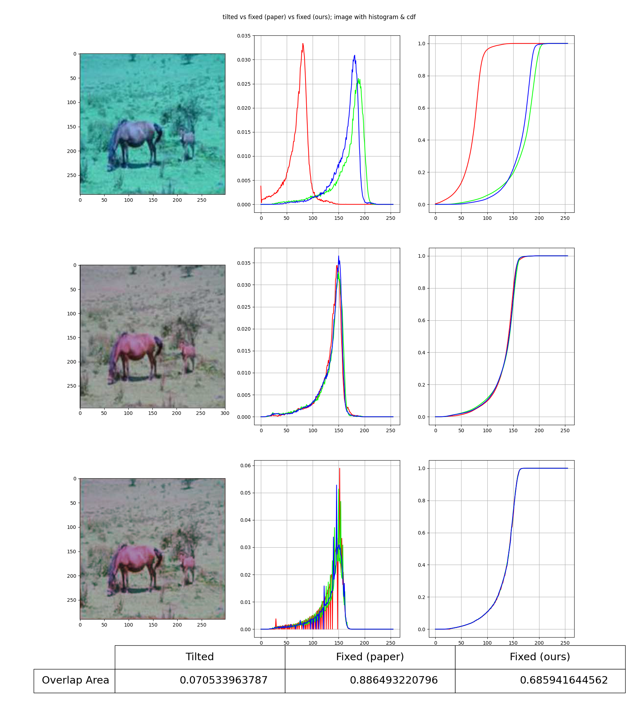
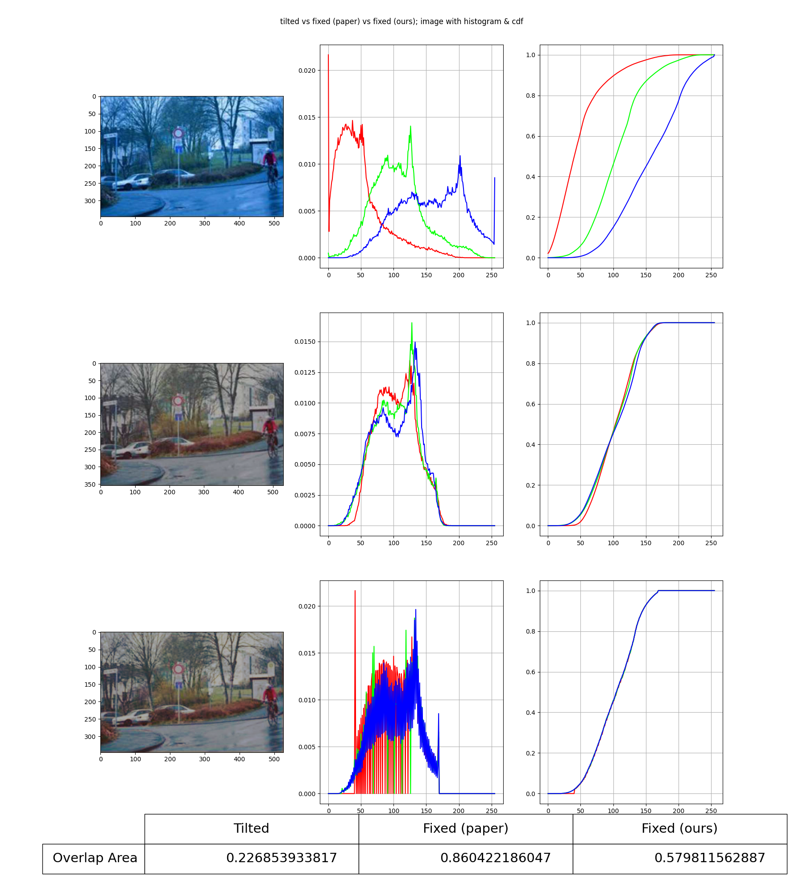
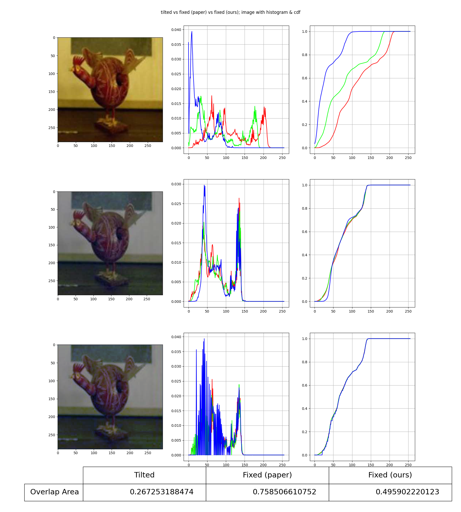
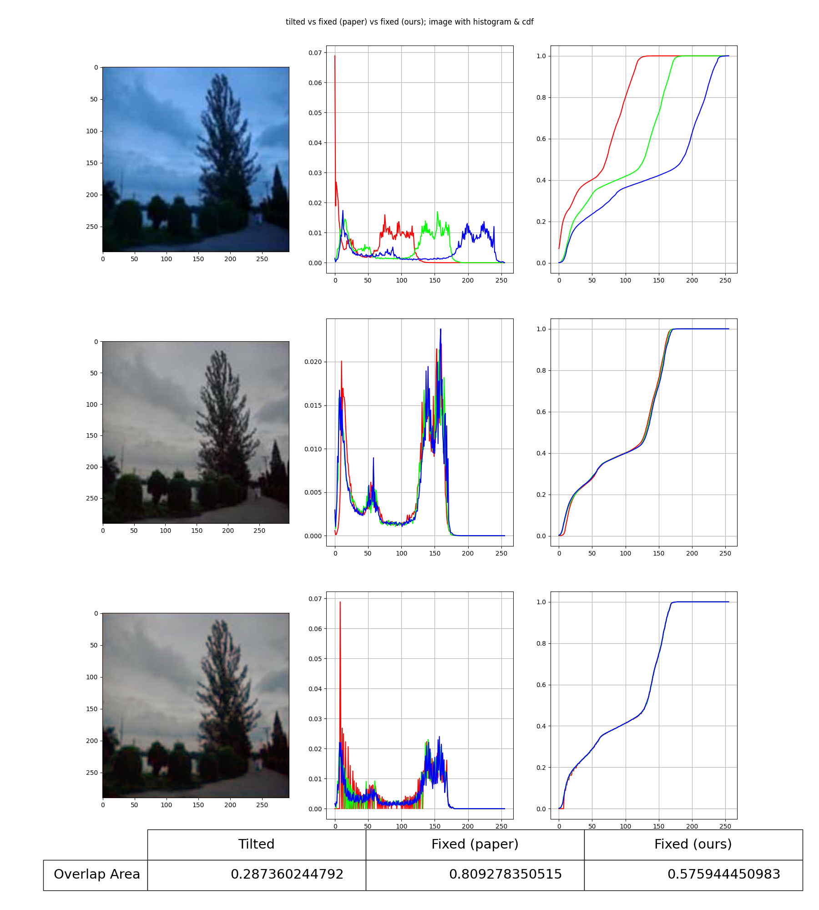
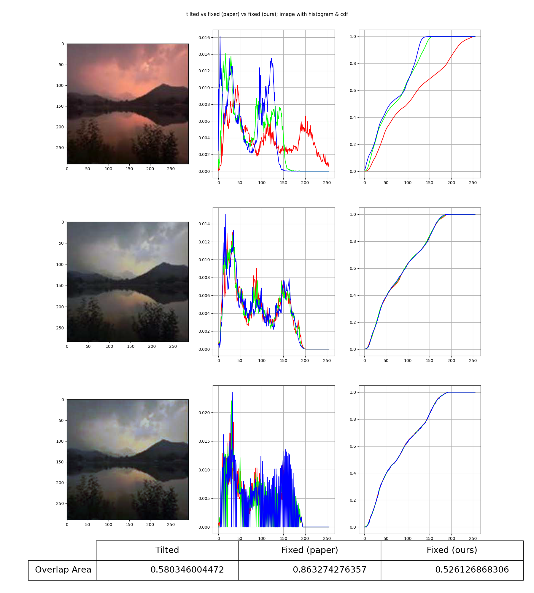
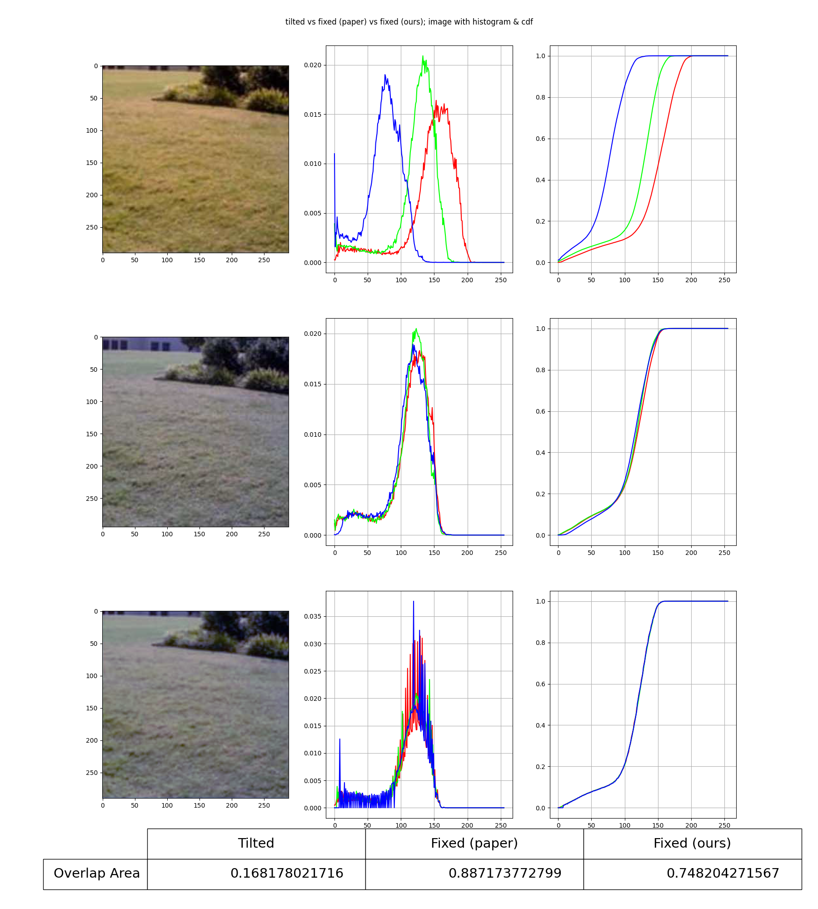

# AWB-HM: A Low Power and Low Complexity Automatic White Balance Algorithm for AMOLED Driving Using Histogram Matching

> Original paper: Chengqiang Huang, Qi Zhang, Hui Wang, and Songlin Feng, "A Low Power and Low Complexity Automatic White Balance Algorithm for AMOLED Driving Using Histogram Matching," J. Display Technol. 11, 53-59 (2015)
>
> This is a reimplementation of the paper, using JAX.

## Usage

1. Install the package `awblib`.
2. From `awblib.hm` import `balance`.
3. Pass to the `balance` with an image, which must be either a JAX array or a numpy array (or compatible formats), with a shape of `(height, width, channels)`, where `channels == 3` (as only supports RGB images for now). There is no specific restrictions on height nor width; it just defines the output shape, as the return value will have same shape as the given input.

## Some Notes on the paper reimplementation

The paper is easy to follow and reimplement. The only difference is that we use a linear interpolation for computing the inversion of $G$ (thus $Z_r = G^{-1}(S_r)$) and then truncate down to integers by removing the fractional parts, rather than just search for the smallest integer that meets the criteria.

## Evaluation on Performance

Our reimplementation has very similar looking as the reported results from the paper. The overlapping area (OA) is not as good as the paper's, which should largely due to the low resolution of the extracted images from the paper's PDF, with the images being lossly compressed, and resolutions being reduced largely. When the resolution becomes smaller, the histogram and CDF of the intensities are less accurate and are subject to more discretisation, leading to a worse colour-restoration result.

## Appendix: Results

